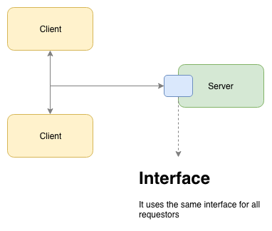

# java11-architecture-api-layer-workshop
* references
    * https://github.com/omniti-labs/jsend
    * https://www.manning.com/books/the-design-of-web-apis
    * https://hub.packtpub.com/defining-rest-and-its-various-architectural-styles/
    * https://blog.restcase.com/restful-api-basic-guidelines/
    * https://dev.to/flippedcoding/what-is-the-difference-between-a-uri-and-a-url-4455
    * https://restful-api-design.readthedocs.io/en/latest/resources.html
    * https://en.wikipedia.org/wiki/HATEOAS
    
## preface
* goals of this workshop:
    * introduction to API
    * general overview of REST
    * investigate how the gateway layer in web application should look like
    * prepare classes that facilitate writing and increase readability of functional tests
* workshops are in
    * `app.gateway.workshop`
    * `app.functional.person.workshop`
    * `app.mockmvc.workshop`

## api
* types of API
    * hardware
        * the social networking mobile application uses the smartphone’s camera to take a photo (via its API)
    * a library
        * use some image library embedded in the application to apply filters to the photo
    * a remote API
        * share photo using a social network server's remote API
* API is an interface: a point where two systems meet and interact
    * it’s an abstraction of the underlying implementation
* example: UI is called called a consumer, and the backend is called a provider
* two kinds: public API and private API
    * public API: provided as a service - you only use them
    * private API: is one you build for yourself (you are your own API provider and API consumer)
    * the public/private question is not a matter of how an API is exposed, but to whom
* questions that should be asked during designing an API
    * who are the users
    * what can users do
    * how do they do it
    * to identify inputs: what they need to do it
    * to identify outputs: what they get in return

## REST
* is a software architectural style that defines a set of constraints 
to be used for creating Web services
* REST API represents its goals using the HTTP protocol
* steps to design REST api
    1. identify resources and their relationships
    1. identify available actions, their parameters and returns (for each resource)
    1. HTTP programming: creating resources paths and choosing HTTP methods to represent actions
* actions are made from the consumer’s perspective;
    * for example, DELETE does not mean that the resource will actually  be deleted from the database, it might 
    simply update resource status to DEACTIVATED
    * if you really cannot find a HTTP method to represent your action, POST could be used as a last resort
* The REST architectural style describes six constraints
    * Uniform interface
    * Stateless
    * Cacheable
    * Client-server architecture
    * A layered system
    * Code on demand (optional)
### Uniform interface

* describes a contract between clients and servers
* once there is a contract aligned with the client and server parts, they can start their works independently 
because, at the end of the day, the way that they will communicate is firmly based on the interface
* is divided into four main groups, called principles:
    * Resource-based
        * URI vs URL
            * URI stands for uniform resource **identifier** and URL stands for uniform resource **locator**
            * That means all URLs are URIs
            * Not all URIs are URLs because a URI could be a name instead of a locator
            * Your name could be a URI because it identifies you, but it couldn't be a URL because it doesn't help anyone find your location
            * On the other hand, your address is both a URI and a URL because it both identifies you and it provides a location for you
        * A resource is an object with a type, associated data, relationships to other resources, and a set of methods that operate on it
        * Resources can be grouped into collections
        * resources is identified by URI
    * The manipulation of resources using representations
        * representation is what will be returned for clients
        * client can request what kind it desires for the representation such as JSON, XML, or plain text
    * Self-descriptive messages
        * Each message includes a precise information that describes how to process it
        * information provided by the RESTful service contains all the information about the resource that the client should be aware of
    * Hypermedia as the Engine of Application State (HATEOAS)
        * request
            ```
            GET /accounts/12345 HTTP/1.1
            Host: bank.example.com
            Accept: application/vnd.acme.account+json
            ...
            ```
        * response
            ```
            HTTP/1.1 200 OK
            Content-Type: application/vnd.acme.account+json
            Content-Length: ...
            
            {
                "account": {
                    "account_number": 12345,
                    "balance": {
                        "currency": "usd",
                        "value": 100.00
                    },
                    "links": {
                        "deposit": "/accounts/12345/deposit",
                        "withdraw": "/accounts/12345/withdraw",
                        "transfer": "/accounts/12345/transfer",
                        "close": "/accounts/12345/close"
                    }
                }
            }
            ```
### Stateless
* necessary state to operate the request is contained within it as a part of the URI, query-string parameters, body, or headers
* Stateless allows high scalability since the server will not maintain sessions
* Another interesting point to note is that the load balancer does not care about sessions at all in stateless systems
### Cacheable
* the request flows through a cache or a series of caches, such as local caching, proxy caching, or reverse proxy 
caching, in front of the service hosting the resource. 
* If any of them match with any criteria during the request (for example, the timestamp or client ID), the data 
is returned based on the cache layer, and if the caches cannot satisfy the request, the request goes to the server
### Client-server architecture
* uniform interface separates clients from servers
* clients are not concerned with data storage, which remains internal to each server, so that the portability of 
client code is improved
* Servers are not engaged with the user interface or user state so they can be simpler and more scalable
* Servers and clients may also be replaced and developed independently, as long as the interface is not modified
### A layered system
* client cannot ordinarily tell whether it is connected directly to the end server, or to an intermediary along the way
* Mediate servers or API Gateways may improve system scalability by enabling load-balancing and by providing shared caches. 
* Layers also enforce security policies.
### Code on demand (optional)
* Servers are able to temporarily extend or customize the functionality of a client by transferring logic to it that it can execute